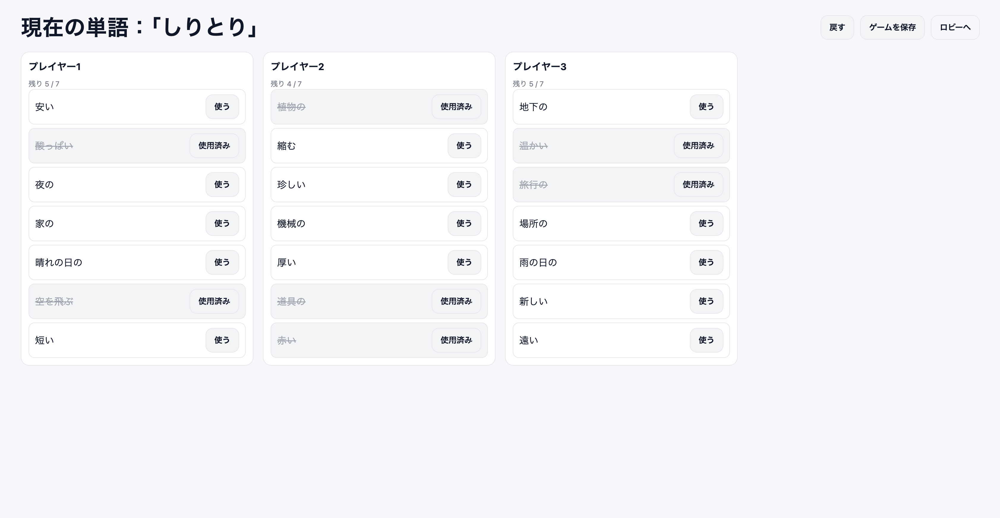

# ピタンゴ風 連想しりとりゲーム

お題の言葉から連想しながら「しりとり」を行うカードゲーム ― ピタンゴ ― のクローン。

## 特徴

* 100%クライアントサイド ― HTML/CSS/JSのみで動作、サーバ不要。
* 代表者1人が操作し、ディスプレイ表示 or 画面共有して全員でプレイ。
* ゲームデータのファイル出力、読み込みして再開可。

## スクリーンショット

**ロビー画面**

**ゲーム画面**

---

Takuto Asakura ([wtsnjp](https://wtsnjp.com))
